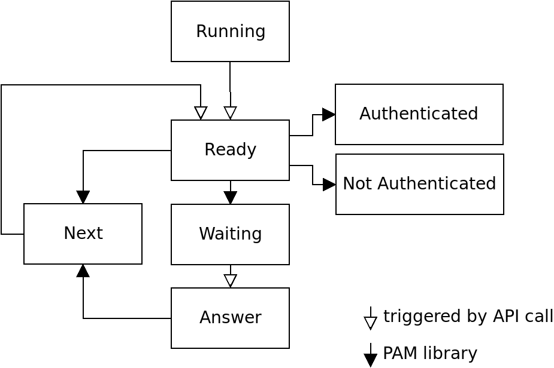

# Build binaries locally

```
make 
make test
```

# Build the binaries in the functional test container

```
cd functional_test
make
```

# Usage of the Server application

## Usage of standalone PAM conversation application

Create pam stack configuration file, e.g.
```
cat /etc/pam.d/allowall
# CentOS
# auth required pam_exec.so debug stdout /usr/bin/echo test

# Ubuntu 
auth required pam_exec.so debug stdout /bin/echo test

auth sufficient pam_allow.so
```

Run the check
```
./auth_check --name allowall
```

Other examples:
[functional_test/pam.d](pam.d)


## Using the HTTP server
**Listening on Unix Domain Socket**

```
./server --socket --verbose --addr /path/to/socket/file/server.socket
```

Using curl to communicate with the server:

```
curl --unix-socket /path/to/socket/file/server.socket -X GET http://local/somepath
```


**Listening on port**

```
./server --verbose --addr 0.0.0.0 --port 8080
```

**Using test container**

```
docker run -p 8080:8080 pam_handshake_test
```

# Software design


